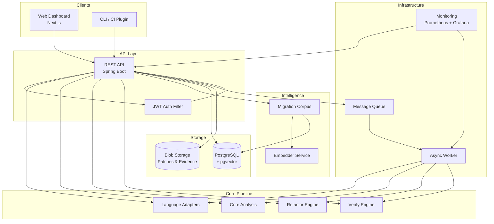
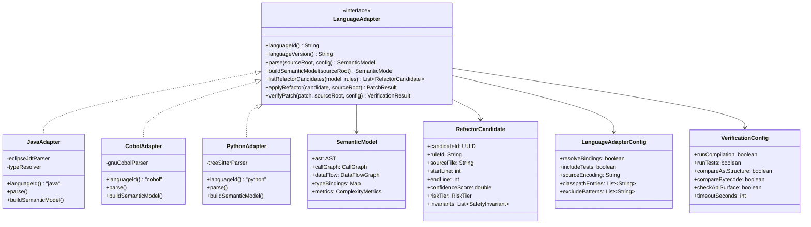
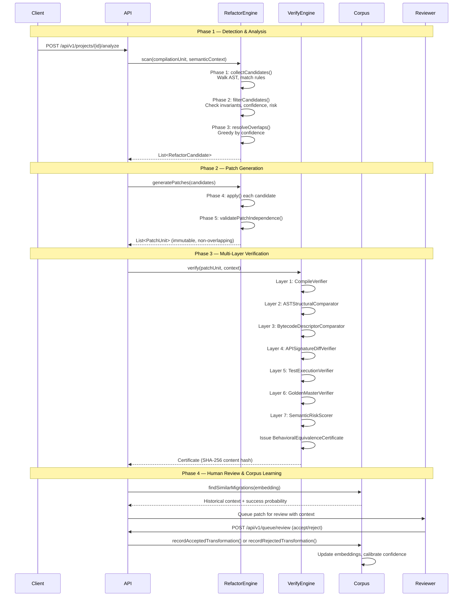
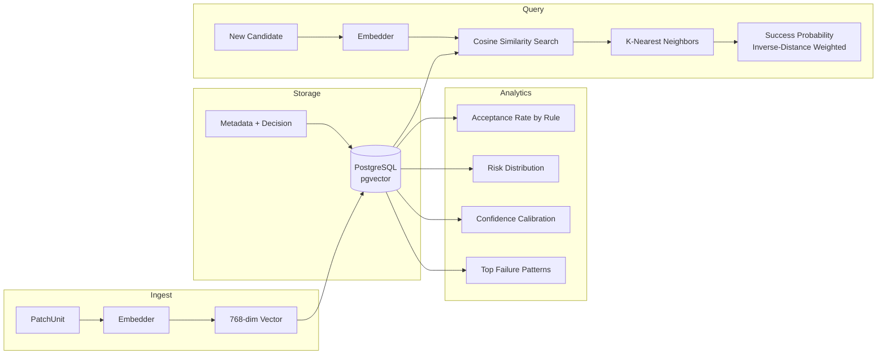
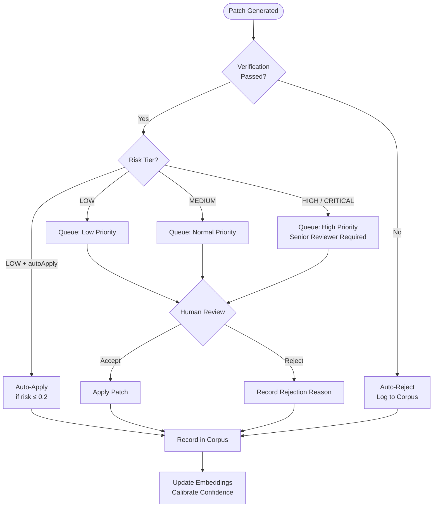
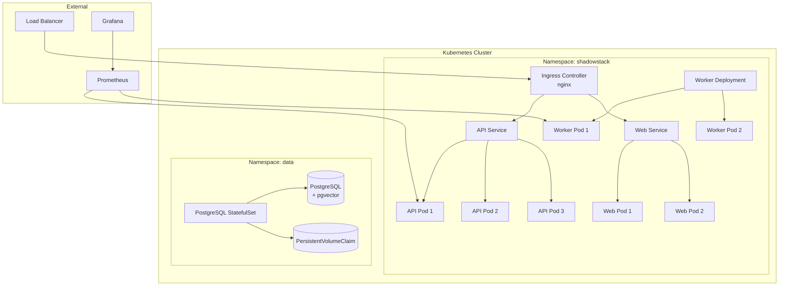

# ShadowStack Architecture

> Enterprise Verified Language Modernization Engine

## 1. System Overview

ShadowStack is a modular, pipeline-oriented system that modernizes legacy codebases through **verified, auditable refactoring**. Every transformation passes through a multi-layer verification pipeline before reaching human review, producing a cryptographically-hashed **Behavioral Equivalence Certificate** as proof of correctness.



## 2. Language Adapter Architecture

The Language Adapter layer provides a **language-agnostic interface** to ShadowStack's pipeline. Each supported language implements the `LanguageAdapter` contract, bridging its native toolchain (parser, type resolver, AST rewriter) into the pipeline.



### Adapter Contract

| Method | Purpose |
|---|---|
| `parse()` | Produce a raw AST-level SemanticModel |
| `buildSemanticModel()` | Enrich with call graphs, data flow, type resolution, and metrics |
| `listRefactorCandidates()` | Identify transformation opportunities using rule sets |
| `applyRefactor()` | Execute a single transformation, produce unified diff |
| `verifyPatch()` | Run multi-layer verification on the result |

Implementations must be **thread-safe** for concurrent invocations on different source roots.

## 3. Verified Refactor Pipeline

The pipeline is the heart of ShadowStack. Every transformation passes through four phases before human review.



### Verification Layers

| Layer | Purpose | Verdict Weight |
|---|---|---|
| CompileVerifier | Ensures patched code compiles | Hard gate |
| ASTStructuralComparator | Compares AST structure pre/post | 0.20 |
| BytecodeDescriptorComparator | Compares method descriptors in bytecode | 0.20 |
| APISignatureDiffVerifier | Ensures public API surface unchanged | 0.15 |
| TestExecutionVerifier | Runs existing tests against patched code | 0.25 |
| GoldenMasterVerifier | Compares output against golden master | 0.10 |
| SemanticRiskScorer | Aggregates risk from all layers | 0.10 |

## 4. Migration Intelligence Corpus

The Migration Corpus is ShadowStack's learning system. It records every transformation decision (accepted or rejected), embeds them using a 768-dimensional vector model, and uses this history to improve future recommendations.

### Architecture



### Key Capabilities

- **Similarity Search**: Find the K most similar past migrations using pgvector cosine similarity
- **Success Probability Estimation**: Inverse-distance-weighted acceptance probability based on 50 nearest neighbors
- **Confidence Calibration**: Tracks predicted confidence vs. actual acceptance rate across buckets
- **Failure Pattern Mining**: Aggregates rejection reasons to identify systematic issues

## 5. Embedder System Design

The embedder converts code snippets and transformation context into dense vector representations for the Migration Corpus.

| Component | Description |
|---|---|
| **Input** | Before snippet + after snippet + rule metadata + AST context |
| **Tokenizer** | Language-aware tokenizer (preserves identifiers, strips comments) |
| **Model** | Fine-tuned CodeBERT (768-dim output) |
| **Storage** | pgvector extension on PostgreSQL |
| **Index** | IVFFlat index with 100 lists for approximate NN search |
| **Distance** | Cosine similarity (`1 - cosine_distance`) |

## 6. Human-in-the-Loop Workflow



### Review Queue Priority

| Risk Tier | Auto-Apply Eligible | Reviewer Level | SLA |
|---|---|---|---|
| COSMETIC | Yes (if ≤ 0.2 risk) | Any | — |
| LOW | No | Any developer | 5 business days |
| MEDIUM | No | Senior developer | 3 business days |
| HIGH | No | Tech lead | 1 business day |
| CRITICAL | No | Architect + Tech lead | Same day |

## 7. Data Flow Diagram

```mermaid
graph TD
    SRC[Source Repository] -->|git clone| INGEST[Ingest Service]
    INGEST -->|source files| PARSE[Language Adapter: Parse]
    PARSE -->|SemanticModel| ANALYZE[Core Analysis]

    ANALYZE -->|CallGraph + DataFlow| BASELINE[Baseline Capture]
    BASELINE -->|BaselineSnapshot| DB[(PostgreSQL)]

    ANALYZE -->|SemanticContext| REFACTOR[Refactor Engine]
    REFACTOR -->|PatchUnit[]| VERIFY[Verify Engine]

    VERIFY -->|BEC Certificate| DB
    VERIFY -->|Evidence artifacts| BLOB[(Blob Storage)]

    DB -->|Patch + Certificate| QUEUE[Review Queue]
    QUEUE -->|Decision| CORPUS[Migration Corpus]
    CORPUS -->|Embedding| PGVEC[(pgvector)]

    QUEUE -->|Accepted patches| APPLY[Patch Applier]
    APPLY -->|Modified source| SRC
```

## 8. Technology Stack

| Layer | Technology | Version | Purpose |
|---|---|---|---|
| **API** | Spring Boot | 3.3.0 | REST API, dependency injection, security |
| **Language** | Java | 21 | Primary implementation language |
| **Web UI** | Next.js + Tailwind CSS | 14.x | Developer dashboard |
| **Database** | PostgreSQL | 16 | Primary data store |
| **Vectors** | pgvector | 0.7.x | Embedding similarity search |
| **Migrations** | Flyway | 10.x | Schema versioning |
| **AST Parsing** | Eclipse JDT Core | 3.36.0 | Java AST parsing with full type resolution |
| **Auth** | jjwt | 0.12.5 | JWT token generation and validation |
| **Build** | Maven | 3.9.x | Multi-module build |
| **Containers** | Docker + Docker Compose | — | Local development and deployment |
| **Orchestration** | Kubernetes | 1.29+ | Production deployment |
| **Monitoring** | Prometheus + Grafana | — | Metrics, alerting, dashboards |
| **Logging** | SLF4J + Logback | 2.0.x | Structured logging |
| **API Docs** | SpringDoc OpenAPI | 2.3.0 | Swagger UI + OpenAPI spec |

## 9. Deployment Architecture



### Resource Requirements

| Component | CPU Request | CPU Limit | Memory Request | Memory Limit | Replicas |
|---|---|---|---|---|---|
| API | 500m | 2000m | 512Mi | 2Gi | 2–5 (HPA) |
| Worker | 1000m | 4000m | 1Gi | 4Gi | 2–4 (HPA) |
| Web | 100m | 500m | 128Mi | 512Mi | 2 |
| PostgreSQL | 500m | 2000m | 1Gi | 4Gi | 1 (StatefulSet) |

### Health Checks

- **Liveness**: `GET /actuator/health/liveness` (HTTP 200)
- **Readiness**: `GET /actuator/health/readiness` (HTTP 200)
- **Startup**: `GET /actuator/health` with 60s initial delay
- **Metrics**: `GET /actuator/prometheus` (Prometheus scrape target)
