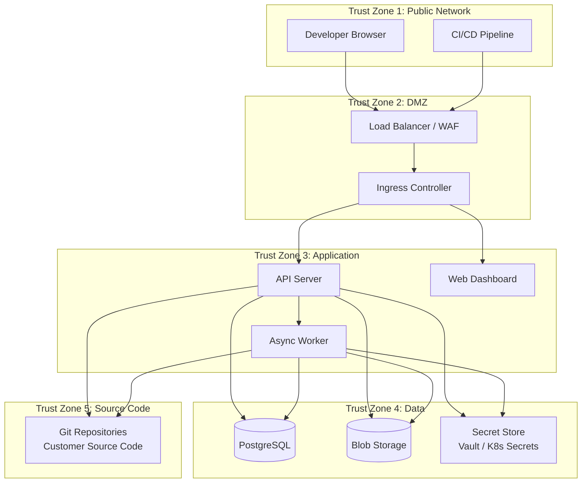

# ShadowStack Threat Model

> Enterprise Security Analysis — STRIDE Framework

## 1. System Boundaries and Trust Zones

### Trust Zone Definitions

| Zone | Description | Trust Level |
|---|---|---|
| TZ1: Public Network | End-user browsers, CI runners | Untrusted |
| TZ2: DMZ | Load balancer, WAF, TLS termination | Low trust |
| TZ3: Application | ShadowStack API, workers, web server | Medium trust |
| TZ4: Data | PostgreSQL, blob storage, secrets | High trust |
| TZ5: Source Code | Customer Git repositories | Highest trust |

## 2. Asset Inventory

| Asset | Classification | Storage Location | Sensitivity |
|---|---|---|---|
| Customer source code | Confidential | Blob storage, temp filesystem | Critical |
| Migration corpus data | Internal | PostgreSQL + pgvector | High |
| Transformation patches | Internal | PostgreSQL, blob storage | High |
| Behavioral Equivalence Certificates | Internal | PostgreSQL | High |
| Audit logs | Compliance | PostgreSQL | High |
| Code embeddings (768-dim vectors) | Internal | PostgreSQL (pgvector) | Medium |
| JWT signing keys | Secret | Kubernetes Secrets / Vault | Critical |
| Database credentials | Secret | Kubernetes Secrets / Vault | Critical |
| API tokens | Secret | In-memory, never persisted | Critical |
| User accounts & roles | Internal | PostgreSQL | High |
| Build artifacts (bytecode) | Temporary | Temp filesystem | Medium |

## 3. Threat Analysis (STRIDE)

### 3.1 Spoofing

#### T-SPOOF-1: Authentication Bypass

- **Target**: API server JWT authentication
- **Attack**: Attacker crafts a JWT with forged claims, bypassing authentication
- **Likelihood**: Medium
- **Impact**: Critical — full API access with arbitrary roles
- **Mitigations**:
  - HMAC-SHA256 signing with minimum 256-bit secret key
  - Token expiration enforced (default: 24 hours)
  - Key rotation supported via configuration reload
  - Token validation on every request via `JwtAuthenticationFilter`

#### T-SPOOF-2: Token Forgery via Weak Secret

- **Target**: JWT signing key
- **Attack**: Brute-force or dictionary attack on weak JWT secret
- **Likelihood**: Low (if configured correctly)
- **Impact**: Critical
- **Mitigations**:
  - Minimum 256-bit secret enforced at startup
  - Production deployment guide mandates cryptographic random secret
  - Secret stored in Vault / Kubernetes Secrets, not in config files

#### T-SPOOF-3: Service Impersonation

- **Target**: Inter-service communication (API ↔ Worker)
- **Attack**: Rogue service joins the cluster and sends malicious jobs
- **Likelihood**: Low
- **Impact**: High
- **Mitigations**:
  - Network policies restrict pod-to-pod communication
  - mTLS via service mesh (Istio) in production
  - Worker authenticates to message queue with credentials

### 3.2 Tampering

#### T-TAMP-1: Patch Manipulation

- **Target**: Generated PatchUnit objects in transit or storage
- **Attack**: Attacker modifies patch content between generation and review
- **Likelihood**: Low
- **Impact**: Critical — malicious code injected via trusted pipeline
- **Mitigations**:
  - BehavioralEquivalenceCertificate includes SHA-256 content hash
  - Certificate integrity verification before review presentation
  - Patches stored as immutable records (no UPDATE operations)
  - Audit log records all state transitions

#### T-TAMP-2: Migration Corpus Poisoning

- **Target**: Migration Corpus embeddings and decision history
- **Attack**: Attacker submits many fake "accept" decisions to bias recommendations
- **Likelihood**: Medium
- **Impact**: High — degraded recommendation quality, unsafe auto-approvals
- **Mitigations**:
  - All review decisions tied to authenticated user identity
  - Rate limiting on review submissions
  - Anomaly detection on corpus statistics (sudden acceptance rate changes)
  - Admin-only corpus purge capability
  - Confidence calibration monitoring alerts

#### T-TAMP-3: Source Code Modification During Analysis

- **Target**: Customer source code on temp filesystem
- **Attack**: Attacker modifies source files while analysis is in progress
- **Likelihood**: Low
- **Impact**: High — incorrect analysis results
- **Mitigations**:
  - Source checkout is read-only (git clone with `--depth 1`)
  - Baseline snapshot captures file hashes before analysis
  - Analysis runs in isolated temp directories
  - Container filesystem is ephemeral (no persistent write access)

### 3.3 Repudiation

#### T-REP-1: Audit Log Tampering

- **Target**: Audit log entries in PostgreSQL
- **Attack**: Insider modifies audit logs to cover tracks
- **Likelihood**: Low
- **Impact**: Critical — breaks compliance chain
- **Mitigations**:
  - Audit log table uses append-only model (no DELETE/UPDATE in application)
  - Database user for application has no DELETE privilege on audit tables
  - Separate read-only audit reporting role
  - Log rotation with checksum chains
  - Export to immutable external log aggregator (Splunk, CloudWatch Logs)

#### T-REP-2: Review Decision Denial

- **Target**: Patch review decisions
- **Attack**: Reviewer denies having approved a patch
- **Likelihood**: Medium
- **Impact**: Medium — compliance dispute
- **Mitigations**:
  - Review decisions include authenticated user ID, timestamp, and reason
  - Audit log entry created atomically with decision
  - JWT subject claim ties action to specific user
  - Optional: digital signature on review decisions

### 3.4 Information Disclosure

#### T-INFO-1: Source Code Leaks

- **Target**: Customer source code in transit and at rest
- **Attack**: Source code exfiltrated from blob storage, temp filesystem, or API responses
- **Likelihood**: Medium
- **Impact**: Critical — intellectual property exposure
- **Mitigations**:
  - TLS 1.3 for all network communication
  - Encryption at rest for blob storage (AES-256)
  - Temp directories cleaned after analysis (finally blocks + scheduled cleanup)
  - API responses never include full source trees — only relevant snippets
  - Network policies prevent egress to unapproved destinations
  - Container images run as non-root user

#### T-INFO-2: Embedding Extraction and Model Inversion

- **Target**: 768-dimensional code embeddings in pgvector
- **Attack**: Attacker extracts embeddings and reconstructs source code structure
- **Likelihood**: Low
- **Impact**: Medium — partial code structure inference
- **Mitigations**:
  - Embeddings are lossy representations (no exact reconstruction possible)
  - Embedding API requires authentication
  - Rate limiting on similarity search endpoints
  - No bulk export of embeddings
  - Database encryption at rest

#### T-INFO-3: Error Message Information Leakage

- **Target**: API error responses
- **Attack**: Error messages reveal internal paths, stack traces, or database schema
- **Likelihood**: Medium
- **Impact**: Low
- **Mitigations**:
  - Custom `ApiErrorResponse` DTO strips internal details
  - Spring Boot `server.error.include-stacktrace=never` in production
  - Validation errors return field names only, not internal identifiers

### 3.5 Denial of Service

#### T-DOS-1: Analysis Resource Exhaustion

- **Target**: Worker nodes performing AST parsing and verification
- **Attack**: Submit extremely large or pathological source trees that consume excessive CPU/memory
- **Likelihood**: Medium
- **Impact**: High — pipeline stall
- **Mitigations**:
  - Configurable max concurrent analyses (`pipeline.max-concurrent-analyses: 4`)
  - Verification timeout (`pipeline.verification-timeout-seconds: 300`)
  - Worker resource limits via Kubernetes (CPU: 4000m, Memory: 4Gi)
  - Source tree size validation before analysis begins
  - Circuit breaker pattern for upstream calls

#### T-DOS-2: API Rate Limiting Bypass

- **Target**: REST API endpoints
- **Attack**: Flood API with requests to exhaust connection pool
- **Likelihood**: Medium
- **Impact**: Medium
- **Mitigations**:
  - HikariCP connection pool limits (max: 20 connections)
  - WAF-level rate limiting per IP
  - Kubernetes HPA auto-scaling for API pods
  - Graceful shutdown enabled (`server.shutdown: graceful`)
  - Request timeout configuration

#### T-DOS-3: Database Connection Exhaustion

- **Target**: PostgreSQL connection pool
- **Attack**: Long-running queries or connection leaks triggered by crafted requests
- **Likelihood**: Low
- **Impact**: High
- **Mitigations**:
  - HikariCP `idle-timeout: 300000`, `connection-timeout: 20000`
  - Statement timeout at database level
  - `spring.jpa.open-in-view: false` prevents accidental long transactions
  - Connection pool monitoring via Actuator metrics

### 3.6 Elevation of Privilege

#### T-EOP-1: RBAC Bypass

- **Target**: Role-based access control on review operations
- **Attack**: Developer with `ROLE_USER` approves a HIGH-risk patch requiring `ROLE_TECH_LEAD`
- **Likelihood**: Medium
- **Impact**: High — unsafe patches applied without proper authorization
- **Mitigations**:
  - Spring Security method-level authorization (`@PreAuthorize`)
  - Risk tier → required role mapping enforced server-side
  - JWT roles claim validated against required role for each operation
  - Audit log records the required vs. actual role for every review

#### T-EOP-2: Unauthorized Auto-Apply

- **Target**: Auto-apply feature for low-risk patches
- **Attack**: Attacker lowers risk score to trigger auto-apply of malicious patch
- **Likelihood**: Low
- **Impact**: Critical
- **Mitigations**:
  - Auto-apply disabled by default (`risk.auto-apply-enabled: false`)
  - Maximum auto-apply risk threshold (`max-auto-apply-risk: 0.2`)
  - Risk score computed server-side, not accepted from client
  - Risk calculation audited with full factor breakdown
  - BehavioralEquivalenceCertificate required before any apply operation

#### T-EOP-3: Container Escape

- **Target**: Worker container running untrusted code analysis
- **Attack**: Malicious source code exploits parsing library vulnerability
- **Likelihood**: Low
- **Impact**: Critical
- **Mitigations**:
  - Containers run as non-root with read-only root filesystem
  - Seccomp and AppArmor profiles enabled
  - No `privileged` mode or host networking
  - Resource limits prevent fork bombs
  - Regular vulnerability scanning of base images

## 4. Security Controls Summary

| Control | Type | Threat(s) Mitigated | Implementation |
|---|---|---|---|
| JWT Authentication | Preventive | SPOOF-1, SPOOF-2 | `JwtAuthenticationFilter` + `JwtTokenProvider` |
| RBAC | Preventive | EOP-1 | Spring Security `@PreAuthorize` |
| TLS 1.3 | Preventive | INFO-1 | Ingress controller TLS termination |
| Encryption at Rest | Preventive | INFO-1, INFO-2 | PostgreSQL TDE, blob storage AES-256 |
| Content Hash | Detective | TAMP-1 | `BehavioralEquivalenceCertificate` SHA-256 |
| Append-Only Audit Log | Detective | REP-1, REP-2 | `AuditService` + database privileges |
| Rate Limiting | Preventive | DOS-1, DOS-2 | WAF + application-level limits |
| Resource Limits | Preventive | DOS-1, DOS-3 | Kubernetes limits, HikariCP config |
| Network Policies | Preventive | SPOOF-3, INFO-1 | Kubernetes NetworkPolicy |
| Input Validation | Preventive | TAMP-3, DOS-1 | Jakarta Bean Validation on all DTOs |
| Non-Root Containers | Preventive | EOP-3 | Kubernetes SecurityContext |
| Patch Immutability | Preventive | TAMP-1 | Append-only storage model |

## 5. Residual Risks

| Risk | Description | Likelihood | Impact | Accepted Rationale |
|---|---|---|---|---|
| R-1 | Eclipse JDT parser vulnerability allows code execution | Very Low | Critical | Mitigated by container isolation; JDT is mature and widely used |
| R-2 | Insider threat from authorized admin | Low | Critical | Mitigated by audit logging and segregation of duties |
| R-3 | Embedding model leaks partial code semantics | Low | Medium | Embeddings are lossy; reconstruction is infeasible |
| R-4 | Supply chain attack via Maven dependency | Low | High | Mitigated by dependency scanning, pinned versions, reproducible builds |
| R-5 | Corpus drift reduces recommendation quality | Medium | Medium | Monitored via confidence calibration; admin purge capability |
